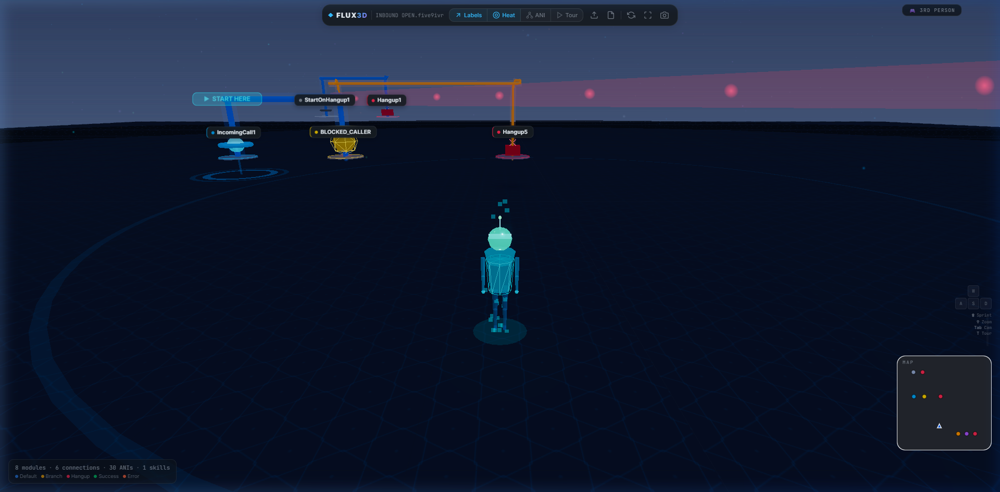
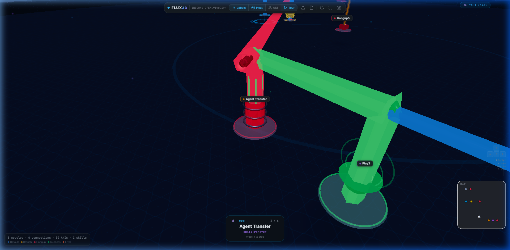
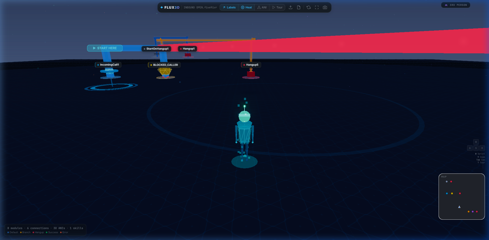
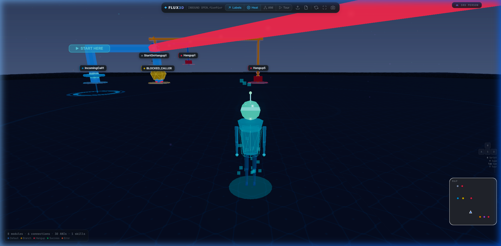

<div align="center">

# ◆ FLUX3D

### An open-source, immersive 3D visualizer for Five9 IVR call flows

Walk through your IVR logic in a navigable 3D environment — complete with a holographic avatar,<br />
animated data cables, real-time analytics, and interactive module inspection.

<br />

[🚀 **Live Demo**](https://ryanshatz.github.io/Flux3D/) &nbsp;·&nbsp; [📖 **Documentation**](#-features) &nbsp;·&nbsp; [⚡ **Quick Start**](#-quick-start) &nbsp;·&nbsp; [🎮 **Controls**](#-controls)

<br />

[](LICENSE)
[](https://threejs.org/)
[](https://vitejs.dev/)
[](https://ryanshatz.github.io/Flux3D/)

</div>

<br />

---

<br />

## 📸 Screenshots

<div align="center">



<sub><b>Full 3D Scene</b> — Navigate an immersive environment with glowing modules, animated data cables, floating particles, and a holographic avatar. The compact toolbar, persistent controls HUD, camera mode badge, and mini-map keep you oriented at all times.</sub>

</div>

<br />

<table>
<tr>
<td width="50%">

<br />
<div align="center"><sub><b>Auto-Tour Mode</b> — Press T or click Tour in the toolbar. The camera flies module-by-module through the call flow, orbiting each one while displaying the module name, type, and progress counter in a floating card.</sub></div>
</td>
<td width="50%">

<br />
<div align="center"><sub><b>Proximity Glow</b> — Walk near any module and it lights up with an emissive boost. Footstep dust puffs trail behind the avatar. Cables near the avatar also brighten to show data flow activating around you.</sub></div>
</td>
</tr>
</table>

<br />

<div align="center">



<sub><b>Dynamic Zoom</b> — Scroll the mouse wheel to zoom in for an over-the-shoulder view, or zoom out for a top-down overview. Camera angle adjusts dynamically with smooth lerping.</sub>

</div>

<br />

---

<br />

## ✨ Features

### 🎮 3rd-Person Avatar Navigation

Control a holographic data-entity that walks around your IVR map at ground level. The avatar features articulated limbs with a detailed walk cycle, a glowing visor, antenna, and trail particles.

| Feature | Description |
|---|---|
| **WASD Movement** | Camera-relative controls — W always means "forward from where you're looking" |
| **Smooth Acceleration** | Speed lerps smoothly — no jarring start/stop |
| **Sprint + FOV Kick** | Hold `Shift` to move 1.8× faster. FOV widens 60°→72° for a visceral speed feel |
| **Dynamic Zoom** | Scroll wheel adjusts distance + angle: over-the-shoulder close, top-down far |
| **Footstep Dust** | Cyan particles puff at the avatar's feet on each step cycle |
| **Free Camera** | Press `Tab` to toggle orbit/free-look mode |
| **Click-to-Walk** | Click any module to smoothly auto-walk there |
| **Double-Click Fly-to** | Double-click any module to teleport or fly the camera |
| **Speed Indicator** | Vertical bar showing IDLE / MOVE / SPRINT with gradient fill |

<br />

### 🎬 Auto-Tour Mode

Press **T** or click the **Tour** button in the toolbar to start an automated camera tour that follows the call flow from entry to exit.

- **BFS-ordered path** — Follows the actual call-flow graph from IncomingCall through downstream modules
- **Smooth fly-between** — Camera transitions smoothly with cubic ease-out between modules
- **Orbit dwell** — Gently orbits each module for 2.5 seconds before advancing
- **Tour info card** — Floating card shows module name, type, and progress (e.g., "3 / 6")
- **Mode badge** — Top-right pill updates to `🎬 TOUR (3/6)` during tour
- **Path tracing** — Each visited module's call path is highlighted with traced cables
- **Press T to stop** — Instantly exits tour and restores your previous camera mode

<br />

### 🌟 World Reactivity

The environment responds to the avatar's position to create a living, interactive feel:

| Feature | Description |
|---|---|
| **Module Proximity Glow** | Modules within 25 units brighten with emissive boost + 1.02× scale |
| **Cable Proximity Glow** | Cables near the avatar light up with distance-based falloff |
| **"START HERE" Beacon** | Entry module has a glowing beacon to guide new users |

<br />

### 🏗️ Premium Module Geometries

Every IVR module type has a unique, identifiable 3D shape sitting on a glowing platform base. All modules feature idle floating animation and a breathing emissive glow.

| Module Type | 3D Shape | Color |
|---|---|---|
| 📞 **IncomingCall** | Torus portal + glowing sphere | Cyan |
| 🎯 **SkillTransfer** | Industrial cylinder with flanges | Orange |
| 🔀 **Case / IfElse** | Diamond octahedron + spinning wireframe | Yellow |
| 📴 **Hangup** | Compact box with X cross | Red |
| 🔊 **Play** | Speaker cone with wave rings | Purple |
| ⚙️ **SetVariable** | Gear torus + center sphere | Steel Blue |
| 🛡️ **BlockedCaller** | Shield with X cross | Pink |
| 🗄️ **CRM / Database** | Stacked disks with connector | Green |

<br />

### 🔌 Animated Cable Routing

Cables use Manhattan routing (orthogonal 90° turns) with smooth CatmullRom curves:

- **🔵 Flowing Data Particles** — Glowing particles travel along each cable showing data flow direction
- **⚡ Electric Pulse Waves** — Periodic brightness spikes travel the cable length
- **💫 Breathing Glow** — Cable emissive intensity oscillates subtly
- **🎨 Color-Coded** — Default (blue), Branch (orange), Hangup (red), Success (green), Error (coral)
- **📊 Volume Scaling** — Thickness, particle density, and glow intensity scale with call volume

<br />

### 📊 Analytics & Diagnostics

| Feature | Description |
|---|---|
| **Heat Map Mode** | Toggle to visualize call volume — thicker cables and brighter modules indicate more traffic |
| **Path Tracing** | Click any module to trace the full upstream + downstream path. Unrelated cables dim to 8% |
| **Dead-End Detection** | Automatically logs unreachable or terminal modules to the console |
| **Live Stats Bar** | Real-time counts of modules, connections, blocked ANIs, and skill transfers |
| **Module Inspector** | Detailed side panel with identity, flow metadata, TTS text, and routing info |
| **ANI Expansion** | Expand blocked caller ANI node clusters around case modules |
| **Mini-Map** | 2D top-down overview with player position tracking |

<br />

### 🖥️ Professional HUD

The interface is designed to stay out of the way while providing constant awareness:

| Element | Location | Description |
|---|---|---|
| **Compact Toolbar** | Top center | Logo, filename, toggle group (Labels/Heat/ANI/Tour), icon-only actions |
| **Mode Badge** | Top right | Shows `🎮 3RD PERSON` / `🎥 ORBIT` / `🎬 TOUR (3/6)` |
| **Info Bar** | Bottom left | Inline stats + color-coded legend dots. Fades to 70% idle |
| **Controls HUD** | Right side | WASD keycap grid + Sprint/Zoom/Cam/Tour hints. Visible at 35% idle |
| **Speed Bar** | Right side | Vertical fill indicator showing movement speed |
| **Mini-Map** | Bottom right | Top-down 2D overview with player position |
| **Onboarding Toast** | Bottom center | First-visit hint: "Use WASD to move · Click modules to inspect" |

<br />

### 🌌 Immersive Atmosphere

- **Gradient Skybox** — Deep navy → charcoal gradient for cinematic depth
- **Hex Circuit Ground** — Dark hex pattern with cyan circuit traces
- **600 Glow Particles** — Additive-blended dust motes drifting upward
- **20 Firefly Accents** — Large, bright particles with pulsing glow
- **Animated Pulse Rings** — 3 concentric rings ripple outward on the ground
- **Bloom Post-Processing** — UnrealBloomPass for signature emissive glow
- **Per-Module Floating** — Gentle sine-wave bob (desynchronized per module)

<br />

### 🔍 Search & Interaction

- **`Ctrl+F` Search** — Real-time module search by name or type
- **Hover Tooltip** — Module name + type with emoji indicator
- **Smooth Hover Effects** — Scale and glow lerp smoothly on hover
- **Path Trace on Click** — Click a module to highlight its full call path
- **📷 Screenshot Export** — Branded PNG snapshots with watermark and timestamp

<br />

---

<br />

## ⚡ Quick Start

### Prerequisites

- [Node.js](https://nodejs.org/) v18 or later
- npm (comes with Node.js)

### Installation

```bash
# Clone the repository
git clone https://github.com/ryanshatz/Flux3D.git

# Navigate to the project
cd Flux3D

# Install dependencies
npm install

# Start the development server
npm run dev
```

Open **http://localhost:5173/Flux3D/** in your browser. The sample IVR script loads automatically.

### Loading Your Own IVR Script

1. Click the **upload icon** in the toolbar
2. Select any `.five9ivr` XML file exported from Five9 VCC
3. The 3D scene builds automatically with spring-animated module entrances

### Adding Heat Map Data

1. Click the **CSV upload icon** in the toolbar
2. Upload a CSV call log with module path and call count columns
3. Cable thickness, particle density, and module glow scale with call volume
4. Toggle the **Heat** button to switch between normal and heat-mapped views

<br />

---

<br />

## 🎮 Controls

### Keyboard

| Key | Action |
|---|---|
| `W` `A` `S` `D` | Move forward / left / backward / right |
| `↑` `←` `↓` `→` | Alternative movement keys |
| `Shift` | Sprint (1.8× speed, FOV kick, camera shake) |
| `Tab` | Toggle 3rd-person ↔ free camera |
| `T` | Start / stop auto-tour |
| `Ctrl+F` | Open module search |
| `Escape` | Close overlays and panels |
| `F11` | Toggle fullscreen |
| `?` | Show keyboard shortcuts |

### Mouse

| Action | Effect |
|---|---|
| **Hover** | Smooth scale-up + glow + tooltip with module info |
| **Click Module** | Select → auto-walk → trace path → open inspector |
| **Double-Click Module** | Teleport avatar (3rd person) or fly camera (orbit) |
| **Click Empty Space** | Clear selection and path trace |
| **Scroll Wheel** | Dynamic zoom with camera angle adjustment |
| **Right-Drag** | Pan camera (free camera mode) |

<br />

---

<br />

## 🛠️ Tech Stack

| Layer | Technology | Purpose |
|---|---|---|
| **3D Engine** | [Three.js](https://threejs.org/) r172 | Scene graph, materials, lighting, post-processing |
| **Post-Processing** | UnrealBloomPass | Emissive glow on modules and cables |
| **Build Tool** | [Vite](https://vitejs.dev/) 6 | Fast HMR, ES module bundling |
| **UI Framework** | Vanilla CSS | Custom design system with glassmorphism |
| **Labels** | CSS2DRenderer | Always-facing module labels |
| **Particles** | Custom glow sprites | Canvas-generated radial gradient textures |
| **Hosting** | GitHub Pages | Static deployment from `gh-pages` branch |

<br />

---

<br />

## 📁 Project Structure

```
Flux3D/
│
├── 📄 index.html                   # Main HTML (toolbar, HUD, inspector, overlays)
├── ⚙️ vite.config.js                # Vite config (GitHub Pages base path)
├── 📦 package.json                  # Dependencies and scripts
├── 📋 INBOUND OPEN.five9ivr         # Sample IVR script (auto-loaded)
│
├── 📂 src/
│   ├── 🚀 main.js                   # App entry — file handling, UI wiring, shortcuts
│   │
│   ├── 📂 styles/
│   │   └── 🎨 main.css              # Full design system (1,500+ lines)
│   │                                  # Toolbar, HUD, tour card, mode badge, etc.
│   │
│   ├── 📂 parser/
│   │   ├── 📖 five9Parser.js        # Five9 XML → module graph + edge list
│   │   └── 🔊 ttsDecoder.js         # TTS prompt text decoder
│   │
│   ├── 📂 data/
│   │   └── 📊 csvParser.js          # Call log CSV → heat map data
│   │
│   ├── 📂 scene/
│   │   ├── 🎬 SceneManager.js       # Three.js orchestrator (1,500+ lines)
│   │   │                              # Proximity glow, auto-tour, path tracing,
│   │   │                              # animations, hover system
│   │   ├── 🏗️ ModuleFactory.js       # 3D geometry builder (10+ module shapes)
│   │   ├── 🔌 CableRenderer.js      # Manhattan cables + flow particles + pulses
│   │   ├── 🤖 AvatarController.js   # 3rd-person character + FOV kick + dust puffs
│   │   │                              # + dynamic zoom + auto-walk
│   │   └── ✨ ParticleSystem.js      # Dual-layer atmosphere (dust + fireflies)
│   │
│   └── 📂 ui/
│       ├── 🔍 InspectorPanel.js      # Module detail sidebar
│       └── 🗺️ MiniMap.js             # 2D top-down overview minimap
│
├── 📂 docs/
│   └── 📂 screenshots/              # README screenshots
│
└── 📂 public/                        # Static assets
```

<br />

---

<br />

## 🚀 Deployment

### GitHub Pages (Recommended)

```bash
# Build production bundle
npm run build

# Deploy to gh-pages branch
npx gh-pages -d dist
```

The site will be available at `https://<username>.github.io/Flux3D/`

### Any Static Host

```bash
npm run build
# Upload contents of dist/ to Netlify, Vercel, Cloudflare Pages, etc.
```

> **Note:** If deploying to a subdirectory, update `base` in `vite.config.js` to match your path.

<br />

---

<br />

## 🤝 Contributing

Contributions are welcome! Flux3D is fully open-source under the MIT license.

1. **Fork** the repository
2. **Create** a feature branch (`git checkout -b feat/amazing-feature`)
3. **Commit** your changes (`git commit -m 'feat: add amazing feature'`)
4. **Push** to the branch (`git push origin feat/amazing-feature`)
5. **Open** a Pull Request

### Ideas for Contributions

- 🎨 Additional module type geometries
- 🔄 Real-time Five9 API integration for live call data
- 📱 Mobile touch controls
- 🎵 Audio feedback and ambient sound
- 🌐 Multi-script comparison view
- 📈 Advanced analytics dashboards

<br />

---

<br />

## 📜 License

This project is licensed under the **MIT License** — see the [LICENSE](LICENSE) file for details.

<br />

---

<div align="center">

<br />

**Built with [Three.js](https://threejs.org/) • Designed for [Five9](https://www.five9.com/) IVR Diagnostics • Open Source**

<br />

Made by [Ryan Shatz](https://github.com/ryanshatz)

</div>
